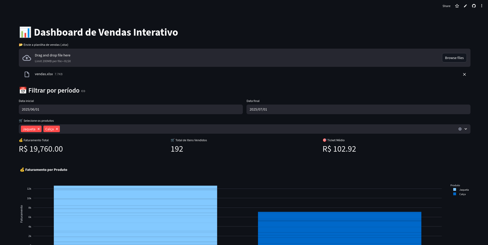

# 📊 Dashboard de Vendas Interativo

Dashboard interativo de vendas feito em Python. Basta enviar uma planilha Excel para ver faturamento, ticket médio e gráficos, com filtros por período e por produto.

🔗 **Demo:** [dashboardvendas.streamlit.app](https://dashboardvendas-nwfekbrxlabmuhe2ntdwrw.streamlit.app/)



---

## ✨ Funcionalidades

- **Upload de planilha** `.xlsx` com os dados de vendas
- **Planilha de exemplo** disponível para download dentro do próprio app, para testar sem precisar de dados próprios
- **Faturamento calculado automaticamente** (quantidade × valor unitário)
- **Filtros** por período (data inicial e final) e por produtos
- **Indicadores (KPIs):** faturamento total, total de itens vendidos e ticket médio
- **Gráficos interativos (Plotly):** faturamento por produto (barras) e faturamento por dia (linha)
- **Tabela de dados filtrados** na tela
- **Exportação em CSV** dos dados filtrados
- Layout largo e responsivo

---

## 🧰 Tecnologias

- [Python](https://www.python.org/)
- [Streamlit](https://streamlit.io/) (interface web e deploy)
- [Pandas](https://pandas.pydata.org/) (leitura e tratamento dos dados)
- [Plotly](https://plotly.com/python/) (gráficos interativos)
- [openpyxl](https://openpyxl.readthedocs.io/) (leitura de arquivos Excel)

---

## 🧾 Formato da planilha

O arquivo enviado **deve conter obrigatoriamente** estas colunas:

| Coluna           | Tipo de dado   | Exemplo    |
| ---------------- | -------------- | ---------- |
| `Data`           | Data           | 2025-08-01 |
| `Produto`        | Texto          | Camiseta   |
| `Quantidade`     | Número inteiro | 10         |
| `Valor Unitário` | Número decimal | 59.90      |

> ⚠️ Os nomes das colunas precisam estar exatamente como acima, com maiúsculas e acentos. Apenas arquivos `.xlsx` são aceitos.

O repositório inclui o arquivo `vendas.xlsx` como modelo.

---

## 🚀 Como rodar localmente

### 1. Pré-requisitos

- [Python 3.9+](https://www.python.org/downloads/)
- [Git](https://git-scm.com/)

### 2. Clonando o repositório

```bash
git clone https://github.com/codariadev/dashboard_vendas.git
cd dashboard_vendas
```

### 3. Criando um ambiente virtual (recomendado)

```bash
python -m venv venv

# Linux / macOS
source venv/bin/activate

# Windows
venv\Scripts\activate
```

### 4. Instalando as dependências

```bash
pip install -r requirements.txt
```

### 5. Executando

```bash
streamlit run streamlit_app.py
```

O app abrirá no navegador, por padrão em [http://localhost:8501](http://localhost:8501).

---

## 📁 Estrutura do projeto

```
dashboard_vendas/
├── streamlit_app.py    # Aplicação principal
├── vendas.xlsx         # Planilha de exemplo
├── requirements.txt    # Dependências
├── thumbnail.png       # Imagem de prévia
└── README.md
```

---

## 📄 Licença

Distribuído sob a licença **MIT**.

---

Criado por [CodariaDev](https://github.com/codariadev) 🚀
